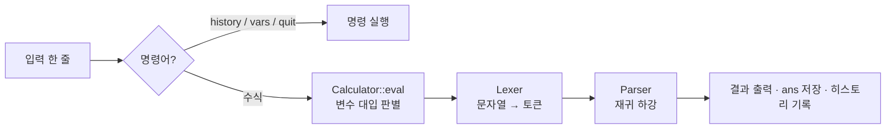
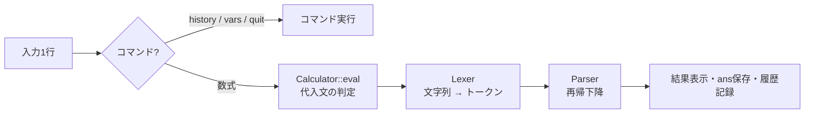

# C++ CLI Calculator

<p align="center">
  <strong>📖 문서 언어 / ドキュメント言語</strong><br>
  <a href="#한국어">한국어</a> · <a href="#日本語">日本語</a>
</p>

<p align="center">
  
</p>

---

## 한국어

### 📌 프로젝트 개요

터미널에서 수식을 입력하면 바로 계산해 주는 **대화형 CLI 계산기**입니다.
괄호와 연산자 우선순위, 변수, 과학 함수를 지원하며, 외부 라이브러리 없이 C++17 표준 라이브러리만으로 구현했습니다.

2023년에 만든 첫 버전(v1)은 `5 + 3`처럼 **숫자 두 개와 연산자 하나**만 계산할 수 있었습니다.
2026년에 입력을 토큰으로 나누는 렉서와 문법 규칙대로 해석하는 파서를 새로 작성해 임의 길이의 수식을 계산하도록 다시 만들었고(REMAKE),
이후 자동 테스트 34개를 작성하며 엣지 케이스 버그를 정리했습니다.

|             | v1 (2023)                     | REMAKE (2026)                              |
| ----------- | ----------------------------- | ------------------------------------------ |
| 입력 형식   | `숫자 연산자 숫자` 한 쌍      | 임의 길이의 수식                           |
| 해석 방식   | 문자열에서 연산자 문자를 검색 | 렉서 + 재귀 하강 파서                      |
| 연산        | `+` `-` `*` `/`               | `+` `-` `*` `/` `^`, 괄호, 단항 부호       |
| 부가 기능   | —                             | 변수, `ans`, 히스토리, 함수 10종, 상수 2종 |
| 자동 테스트 | 없음                          | 34개                                       |
| 코드 규모   | 123줄                         | 326줄                                      |

### 👤 개발 기간 · 형태 · 역할

| 항목      | 내용                                   |
| --------- | -------------------------------------- |
| 개발 기간 | v1: 2023년 중순 / REMAKE: 2026년 2월 ~ |
| 개발 형태 | 개인 프로젝트                          |
| 담당      | 전체 (설계 · 구현 · 테스트)            |

### 🛠 기술 스택

| 기술            | 버전      | 용도                                   |
| --------------- | --------- | -------------------------------------- |
| C++             | C++17     | 구현 언어 (표준 라이브러리만 사용)     |
| CMake           | 3.10 이상 | 빌드 (선택)                            |
| GNU Make        | —         | 빌드 (기본)                            |
| Bash + Python 3 | —         | 테스트 러너 (Python은 타임아웃 처리용) |

확인 환경: macOS, Apple Clang 21.0.0

### ✨ 주요 기능

| 기능                 | 예시              | 구현 방식                                                                                             |
| -------------------- | ----------------- | ----------------------------------------------------------------------------------------------------- |
| 사칙연산 · 거듭제곱  | `2+3*4` → 14      | 우선순위 단계마다 파서 함수를 하나씩 두어 우선순위를 문법 구조로 표현                                 |
| 오른쪽 결합 거듭제곱 | `2^3^2` → 512     | `^`의 오른쪽을 같은 함수로 재귀 호출해 오른쪽부터 계산                                                |
| 괄호                 | `(2+3)*4` → 20    | 괄호를 만나면 최상위 수식 파서를 재귀 호출                                                            |
| 지수 표기법          | `1.5e-3` → 0.0015 | 렉서가 `e`/`E` 뒤의 부호·숫자까지 한 토큰으로 읽고, `std::stod`가 끝까지 변환했는지 검증              |
| 변수 대입            | `x = 10`          | 첫 `=`로 좌우를 나누고, 좌변의 이름 규칙과 예약어 18개를 검사한 뒤 우변만 파싱                        |
| 내장 상수            | `pi`, `e`         | 변수 맵에 미리 등록하고 예약어로 지정해 덮어쓰기를 막음                                               |
| 직전 결과            | `ans * 2`         | 계산이 성공할 때마다 `ans` 변수를 갱신                                                                |
| 계산 히스토리        | `history`         | 최대 100개를 보관하고, 넘치면 가장 오래된 항목부터 삭제                                               |
| 과학 함수 10종       | `sin(pi/2)` → 1   | 함수 이름 뒤에 `(`가 오면 함수 호출로 해석. `pow`만 인자 2개                                          |
| 에러 처리            | `log(0)` → Error  | 연산 결과마다 `std::isfinite` 검사로 오버플로·정의역 오류를 검출하고, 해석 후 남은 토큰은 에러로 보고 |

함수 · 상수 · 명령어의 전체 목록은 아래 [부록](#-부록-사용법-레퍼런스)에 있습니다.

### 🏗 아키텍처



| 구성 요소    | 역할                                                              |
| ------------ | ----------------------------------------------------------------- |
| `Lexer`      | 문자열을 숫자 · 식별자 · 연산자 · 괄호 · 쉼표 · `=` 토큰으로 분리 |
| `Parser`     | 토큰을 문법 규칙에 따라 해석하면서 바로 값을 계산                 |
| `Calculator` | 변수 맵, `ans`, 히스토리를 관리하고 대입문을 처리                 |
| `main`       | 입력을 받는 REPL 루프와 명령어 처리                               |

파서는 다음 문법을 그대로 함수로 옮긴 구조입니다. 규칙 하나가 함수 하나이고, 아래로 갈수록 우선순위가 높습니다.

```text
expr   = term   { ("+" | "-") term }          → parseExpr()
term   = factor { ("*" | "/") factor }        → parseTerm()
factor = ("+" | "-") factor | base [ "^" factor ]   → parseFactor()
base   = NUMBER | IDENT | IDENT "(" args ")" | "(" expr ")"   → parseBase()
```

`factor`의 정의 때문에 단항 부호가 `^`보다 나중에 적용됩니다. 예를 들어 `-2^2`는 `-(2^2)` = -4입니다.

### 💡 설계 포인트

**1. 재귀 하강 파서**
v1은 문자열에서 연산자 문자를 찾아 좌우로 자르는 방식이라 연산자가 두 개 이상인 식은 처리할 수 없었습니다.
REMAKE에서는 위 문법의 규칙마다 함수를 하나씩 두는 재귀 하강 방식으로 바꿨습니다.
괄호는 `parseBase()`가 다시 `parseExpr()`를 호출하는 재귀로 처리되고, 연산자 우선순위는 함수 호출 순서로 정해집니다.
문법과 코드가 1:1로 대응하기 때문에 새 연산자나 함수를 추가할 위치가 분명하고, 잘못된 토큰을 만난 지점에서 바로 에러를 낼 수 있습니다.

**2. 트리를 만들지 않고 바로 계산**
파서 함수가 구문 트리(AST)를 만들지 않고 계산 결과(`double`)를 바로 반환합니다.
한 줄씩 입력받아 즉시 계산하는 계산기에는 이 방식으로 충분하고 코드가 단순해집니다.
대신 식을 저장해 두었다가 다시 계산하는 기능은 이 구조로는 만들 수 없습니다.

**3. 대입문은 파서 밖에서 처리**
`x = 식` 형태는 `Calculator::eval()`이 먼저 판별하고, 파서에는 우변만 넘깁니다.
파서 문법에 대입 규칙을 넣지 않아도 되므로 문법이 단순하게 유지됩니다.

**4. 표준 입출력 기반 블랙박스 테스트**
프로그램이 표준 입력과 표준 출력만 사용하기 때문에, 파이프로 입력을 넣고 출력을 정규식으로 확인하는 방식으로 테스트합니다.
각 테스트에 2초 타임아웃을 걸어 무한 루프도 실패로 검출합니다.

### 🔧 겪은 문제와 해결 과정

#### EOF 입력 시 무한 루프

| 단계      | 내용                                                                                                                                                                                                        |
| --------- | ----------------------------------------------------------------------------------------------------------------------------------------------------------------------------------------------------------- |
| 증상      | 파이프로 입력을 넣거나(`echo "1+1" \| ./calculator`) Ctrl+D를 누르면 프로그램이 끝나지 않고 `> ` 프롬프트를 계속 출력                                                                                       |
| 원인      | `std::getline()`의 반환값을 확인하지 않았습니다. EOF에서 `getline`은 입력 문자열을 비운 채 실패하는데, 루프는 이를 "빈 줄"로 보고 `continue`했고, 다음 `getline`도 즉시 실패하면서 루프가 끝나지 않았습니다 |
| 해결      | `if (!std::getline(std::cin, input)) break;`로 스트림 실패 시 루프를 종료                                                                                                                                   |
| 재발 방지 | 테스트 러너에 2초 타임아웃을 두고, `quit` 없이 EOF로 끝나는 입력을 테스트 케이스(B1)로 추가                                                                                                                 |
| 결과      | 파이프 입력이 정상 종료되면서 전체 테스트를 스크립트 하나로 자동 실행할 수 있게 됨                                                                                                                          |

#### 그 밖에 수정한 동작

REMAKE 직후 버전과 현재 버전에 같은 입력을 넣어 확인한 결과입니다.

| 입력      | 수정 전       | 수정 후   | 원인                                          |
| --------- | ------------- | --------- | --------------------------------------------- |
| `1+2)`    | `3`           | Error     | 해석이 끝난 뒤 남은 `)`를 무시                |
| `1,2`     | `1`           | Error     | 남은 `,`를 무시                               |
| `1 2`     | `12`          | Error     | 공백을 모두 지운 뒤 해석                      |
| `1.2.3`   | `1.2`         | Error     | `std::stod`가 앞부분만 변환해도 성공으로 처리 |
| `log(0)`  | `-inf`        | Error     | 계산 결과의 유한성 검사 없음                  |
| `sin=3`   | `3` (대입됨)  | Error     | 예약어 검사 없음                              |
| `1234567` | `1.23457e+06` | `1234567` | 기본 출력 정밀도 6자리 → 12자리로 변경        |

이 밖에 `std::isdigit` 등에 한글 같은 멀티바이트 문자의 바이트(음수 `char`)가 그대로 전달되던 문제를 `unsigned char` 변환으로 수정했습니다. 음수 값을 넘기는 것은 C++ 표준상 정의되지 않은 동작입니다.

### 📊 프로젝트 지표

| 항목                    | 값                          |                         |
| ----------------------- | --------------------------- | ----------------------- |
| 개발 시작               | 2026년 2월 (v1: 2023년)     | (v1은 저장소 생성 이전) |
| 개발 인원               | 1명 (개인 프로젝트)         | —                       |
| 소스 규모               | 326줄 (`main.cpp`)          | `wc -l`                 |
| 자동 테스트             | 34개 (전체 통과)            | `tests/run.sh`          |
| 지원 함수 · 상수 · 명령 | 함수 10 / 상수 2 / 명령 3종 | `main.cpp`              |

### ▶️ 빌드 · 실행 · 테스트

요구 사항: C++17을 지원하는 GCC 또는 Clang. CMake로 빌드할 경우 CMake 3.10 이상.

```bash
# Makefile (기본)
make
./calculator

# CMake
mkdir build && cd build
cmake ..
make
./bin/calculator

# 직접 컴파일
g++ -std=c++17 -Wall -Wextra -O2 -o calculator main.cpp
```

테스트 실행 (Bash, Python 3 필요):

```bash
bash tests/run.sh
```

### 🧭 알려진 한계와 개선 계획

- 에러 메시지가 잘못된 문자를 1바이트 단위로 출력하므로, 한글 같은 멀티바이트 문자를 입력하면 메시지의 해당 부분이 깨집니다. UTF-8 문자 단위로 출력하도록 개선할 예정입니다.
- 부동소수점 한계로 `tan(pi/2)`처럼 수학적으로 정의되지 않는 값이 에러가 아니라 매우 큰 수(`1.63e+16`)로 출력됩니다.
- 테스트 러너가 Bash 스크립트이므로 Windows에서는 WSL이나 Git Bash가 필요합니다.
- 구문 트리를 만들지 않는 구조이기 때문에, 사용자 정의 함수처럼 식을 저장해 두는 기능을 넣으려면 AST 도입이 먼저 필요합니다.

### 🔗 관련 프로젝트 (계산기 시리즈)

- [RUST-GUI-Calculator](https://github.com/QCoQCo/RUST-GUI-Calculator)
- [Rust-cli-calc](https://github.com/QCoQCo/Rust-cli-calc)

### 📎 부록: 사용법 레퍼런스

<details>
<summary>입력 예시</summary>

```
> 5+3
Result: 8
> (1+2)*4
Result: 12
> x = 10
Result: 10
> x * 2 + ans
Result: 30
> sin(pi / 2)
Result: 1
> 1e5 + 2.5e3
Result: 102500
> history
  5+3 = 8
  (1+2)*4 = 12
  x = 10 = 10
  x * 2 + ans = 30
  sin(pi / 2) = 1
  1e5 + 2.5e3 = 102500
> vars
  ans = 102500
  e = 2.71828182846
  pi = 3.14159265359
  x = 10
> quit
Goodbye!
```

</details>

<details>
<summary>함수 · 상수 · 명령어 목록</summary>

| 함수                         | 설명     | 비고              |
| ---------------------------- | -------- | ----------------- |
| `sin(x)`, `cos(x)`, `tan(x)` | 삼각함수 | 인자 단위: 라디안 |
| `sqrt(x)`                    | 제곱근   | x ≥ 0             |
| `log(x)`, `ln(x)`            | 자연로그 | x > 0             |
| `log10(x)`                   | 상용로그 | x > 0             |
| `exp(x)`                     | e^x      |                   |
| `abs(x)`                     | 절댓값   |                   |
| `pow(x, y)`                  | x^y      | 인자 2개          |

| 상수 | 값            |
| ---- | ------------- |
| `pi` | 3.14159265359 |
| `e`  | 2.71828182846 |

| 명령어              | 동작                         |
| ------------------- | ---------------------------- |
| `history`           | 최근 계산 목록 (최대 100개)  |
| `vars`              | 변수 목록 (상수, `ans` 포함) |
| `quit`, `exit`, `q` | 종료                         |

</details>

<details>
<summary>변수 이름 규칙</summary>

- 영문자 또는 `_`로 시작하고, 이후에는 영문자 · 숫자 · `_`만 사용할 수 있습니다.
  예: `x`, `_val`, `radius2` (O) / `2x`, `my-var` (X)
- 함수 이름, 명령어, `pi`, `e`, `ans`는 예약어라 대입할 수 없습니다.

</details>

---

## 日本語

### 📌 プロジェクト概要

ターミナルに数式を入力すると即座に計算する**対話型CLI電卓**です。
括弧・演算子の優先順位・変数・科学関数に対応しており、外部ライブラリを使わずC++17の標準ライブラリのみで実装しています。

2023年に作成した最初のバージョン（v1）は、`5 + 3` のように**数値2つと演算子1つ**しか計算できませんでした。
2026年に、入力をトークンに分割するレキサーと文法規則に沿って解釈するパーサを新たに実装し、任意の長さの数式を計算できるよう作り直しました（REMAKE）。
その後、自動テストを34件作成し、エッジケースのバグを修正しています。

|            | v1 (2023)                    | REMAKE (2026)                        |
| ---------- | ---------------------------- | ------------------------------------ |
| 入力形式   | `数値 演算子 数値` の1組のみ | 任意の長さの数式                     |
| 解釈方式   | 文字列から演算子文字を検索   | レキサー + 再帰下降パーサ            |
| 演算       | `+` `-` `*` `/`              | `+` `-` `*` `/` `^`、括弧、単項符号  |
| 付加機能   | —                            | 変数、`ans`、履歴、関数10種、定数2種 |
| 自動テスト | なし                         | 34件                                 |
| コード規模 | 123行                        | 326行                                |

### 👤 開発期間・形態・担当

| 項目     | 内容                                 |
| -------- | ------------------------------------ |
| 開発期間 | v1：2023年中頃 / REMAKE：2026年2月〜 |
| 開発形態 | 個人開発                             |
| 担当     | 全工程（設計・実装・テスト）         |

### 🛠 技術スタック

| 技術            | バージョン | 用途                                         |
| --------------- | ---------- | -------------------------------------------- |
| C++             | C++17      | 実装言語（標準ライブラリのみ使用）           |
| CMake           | 3.10以上   | ビルド（任意）                               |
| GNU Make        | —          | ビルド（標準）                               |
| Bash + Python 3 | —          | テストランナー（Pythonはタイムアウト処理用） |

動作確認環境：macOS、Apple Clang 21.0.0

### ✨ 主な機能

| 機能           | 例                | 実装方法                                                                                                        |
| -------------- | ----------------- | --------------------------------------------------------------------------------------------------------------- |
| 四則演算・累乗 | `2+3*4` → 14      | 優先順位の段階ごとにパーサ関数を1つずつ用意し、優先順位を文法構造で表現                                         |
| 右結合の累乗   | `2^3^2` → 512     | `^` の右辺を同じ関数で再帰呼び出しし、右側から計算                                                              |
| 括弧           | `(2+3)*4` → 20    | 括弧を検出すると最上位の数式パーサを再帰呼び出し                                                                |
| 指数表記       | `1.5e-3` → 0.0015 | レキサーが `e`/`E` 以降の符号・数字まで1トークンとして読み取り、`std::stod` が最後まで変換できたかを検証        |
| 変数代入       | `x = 10`          | 最初の `=` で左右に分割し、左辺の命名規則と予約語18個をチェックしたうえで右辺のみをパース                       |
| 組み込み定数   | `pi`, `e`         | 変数マップに事前登録し、予約語として上書きを禁止                                                                |
| 直前の結果     | `ans * 2`         | 計算が成功するたびに `ans` を更新                                                                               |
| 計算履歴       | `history`         | 最大100件を保持し、超過時は最も古い項目から削除                                                                 |
| 科学関数10種   | `sin(pi/2)` → 1   | 識別子の直後に `(` があれば関数呼び出しとして解釈。`pow` のみ引数2つ                                            |
| エラー処理     | `log(0)` → Error  | 演算結果ごとに `std::isfinite` でオーバーフロー・定義域エラーを検出し、解釈後に残ったトークンはエラーとして報告 |

関数・定数・コマンドの一覧は下記の[付録](#-付録使い方リファレンス)にまとめています。

### 🏗 アーキテクチャ



| コンポーネント | 役割                                                             |
| -------------- | ---------------------------------------------------------------- |
| `Lexer`        | 文字列を数値・識別子・演算子・括弧・カンマ・`=` のトークンに分割 |
| `Parser`       | トークンを文法規則に従って解釈しながら、その場で値を計算         |
| `Calculator`   | 変数マップ・`ans`・履歴を管理し、代入文を処理                    |
| `main`         | 入力を受け付けるREPLループとコマンド処理                         |

パーサは以下の文法をそのまま関数に置き換えた構造です。1つの規則が1つの関数に対応し、下に行くほど優先順位が高くなります。

```text
expr   = term   { ("+" | "-") term }          → parseExpr()
term   = factor { ("*" | "/") factor }        → parseTerm()
factor = ("+" | "-") factor | base [ "^" factor ]   → parseFactor()
base   = NUMBER | IDENT | IDENT "(" args ")" | "(" expr ")"   → parseBase()
```

`factor` の定義により、単項符号は `^` より後に適用されます。例えば `-2^2` は `-(2^2)` = -4 です。

### 💡 設計のポイント

**1. 再帰下降パーサ**
v1は文字列から演算子文字を探して左右に分割する方式だったため、演算子が2つ以上ある式は扱えませんでした。
REMAKEでは、上記の文法規則ごとに関数を1つずつ用意する再帰下降方式に変更しました。
括弧は `parseBase()` が再び `parseExpr()` を呼び出す再帰で処理され、演算子の優先順位は関数の呼び出し順で決まります。
文法とコードが1対1で対応するため、新しい演算子や関数を追加する箇所が明確で、不正なトークンを検出した時点ですぐにエラーを返せます。

**2. 構文木を作らずに直接計算**
パーサ関数は構文木（AST）を構築せず、計算結果（`double`）を直接返します。
1行ずつ入力を受けて即座に計算する電卓にはこの方式で十分であり、コードも簡潔になります。
一方で、式を保存して後から再計算する機能はこの構造では実現できません。

**3. 代入文はパーサの外で処理**
`x = 式` の形式は `Calculator::eval()` が先に判定し、パーサには右辺のみを渡します。
パーサの文法に代入規則を加える必要がないため、文法をシンプルに保てます。

**4. 標準入出力を使ったブラックボックステスト**
プログラムが標準入力と標準出力のみを使用するため、パイプで入力を与えて出力を正規表現で確認する方式でテストしています。
各テストに2秒のタイムアウトを設定し、無限ループも失敗として検出します。

### 🔧 課題と解決

#### EOF入力時の無限ループ

| 段階     | 内容                                                                                                                                                                                                                         |
| -------- | ---------------------------------------------------------------------------------------------------------------------------------------------------------------------------------------------------------------------------- |
| 現象     | パイプで入力を渡す（`echo "1+1" \| ./calculator`）か Ctrl+D を押すと、プログラムが終了せず `> ` プロンプトを出力し続ける                                                                                                     |
| 原因     | `std::getline()` の戻り値を確認していませんでした。EOFでは `getline` が入力文字列を空にしたまま失敗しますが、ループはこれを「空行」とみなして `continue` し、次の `getline` も即座に失敗するため、ループが終了しませんでした |
| 解決     | `if (!std::getline(std::cin, input)) break;` とし、ストリームの失敗時にループを終了                                                                                                                                          |
| 再発防止 | テストランナーに2秒のタイムアウトを設け、`quit` なしでEOFで終わる入力をテストケース（B1）として追加                                                                                                                          |
| 結果     | パイプ入力で正常終了するようになり、全テストをスクリプト1本で自動実行できるようになった                                                                                                                                      |

#### その他の修正

REMAKE直後のバージョンと現在のバージョンに同じ入力を与えて確認した結果です。

| 入力      | 修正前            | 修正後    | 原因                                         |
| --------- | ----------------- | --------- | -------------------------------------------- |
| `1+2)`    | `3`               | Error     | 解釈終了後に残った `)` を無視                |
| `1,2`     | `1`               | Error     | 残った `,` を無視                            |
| `1 2`     | `12`              | Error     | 空白をすべて除去してから解釈                 |
| `1.2.3`   | `1.2`             | Error     | `std::stod` が先頭部分だけ変換しても成功扱い |
| `log(0)`  | `-inf`            | Error     | 計算結果の有限性チェックなし                 |
| `sin=3`   | `3`（代入される） | Error     | 予約語チェックなし                           |
| `1234567` | `1.23457e+06`     | `1234567` | 出力精度を標準の6桁から12桁に変更            |

このほか、`std::isdigit` などにハングルのようなマルチバイト文字のバイト（負の `char`）がそのまま渡されていた問題を、`unsigned char` への変換で修正しました。負の値を渡すことはC++標準で未定義動作とされています。

### 📊 プロジェクト指標

| 項目                     | 値                           |                          |
| ------------------------ | ---------------------------- | ------------------------ |
| 開発開始                 | 2026年2月（v1：2023年）      | （v1はリポジトリ作成前） |
| 開発人数                 | 1名（個人開発）              | —                        |
| ソース規模               | 326行（`main.cpp`）          | `wc -l`                  |
| 自動テスト               | 34件（全件成功）             | `tests/run.sh`           |
| 対応関数・定数・コマンド | 関数10 / 定数2 / コマンド3種 | `main.cpp`               |

### ▶️ ビルド・実行・テスト

必要環境：C++17対応のGCCまたはClang。CMakeでビルドする場合はCMake 3.10以上。

```bash
# Makefile（標準）
make
./calculator

# CMake
mkdir build && cd build
cmake ..
make
./bin/calculator

# 直接コンパイル
g++ -std=c++17 -Wall -Wextra -O2 -o calculator main.cpp
```

テストの実行（Bash・Python 3 が必要）：

```bash
bash tests/run.sh
```

### 🧭 既知の制約と今後の改善

- エラーメッセージが不正な文字を1バイト単位で出力するため、ハングルなどのマルチバイト文字を入力するとメッセージの該当部分が文字化けします。UTF-8の文字単位で出力するよう改善する予定です。
- 浮動小数点の制約により、`tan(pi/2)` のように数学的に定義されない値がエラーではなく非常に大きな数（`1.63e+16`）として出力されます。
- テストランナーがBashスクリプトのため、WindowsではWSLまたはGit Bashが必要です。
- 構文木を作らない構造のため、ユーザー定義関数のように式を保存する機能を追加するには、先にASTの導入が必要です。

### 🔗 関連プロジェクト（電卓シリーズ）

- [RUST-GUI-Calculator](https://github.com/QCoQCo/RUST-GUI-Calculator)
- [Rust-cli-calc](https://github.com/QCoQCo/Rust-cli-calc)

### 📎 付録：使い方リファレンス

<details>
<summary>入力例</summary>

```
> 5+3
Result: 8
> (1+2)*4
Result: 12
> x = 10
Result: 10
> x * 2 + ans
Result: 30
> sin(pi / 2)
Result: 1
> 1e5 + 2.5e3
Result: 102500
> history
  5+3 = 8
  (1+2)*4 = 12
  x = 10 = 10
  x * 2 + ans = 30
  sin(pi / 2) = 1
  1e5 + 2.5e3 = 102500
> vars
  ans = 102500
  e = 2.71828182846
  pi = 3.14159265359
  x = 10
> quit
Goodbye!
```

</details>

<details>
<summary>関数・定数・コマンド一覧</summary>

| 関数                         | 説明     | 備考           |
| ---------------------------- | -------- | -------------- |
| `sin(x)`, `cos(x)`, `tan(x)` | 三角関数 | 引数はラジアン |
| `sqrt(x)`                    | 平方根   | x ≥ 0          |
| `log(x)`, `ln(x)`            | 自然対数 | x > 0          |
| `log10(x)`                   | 常用対数 | x > 0          |
| `exp(x)`                     | e^x      |                |
| `abs(x)`                     | 絶対値   |                |
| `pow(x, y)`                  | x^y      | 引数2つ        |

| 定数 | 値            |
| ---- | ------------- |
| `pi` | 3.14159265359 |
| `e`  | 2.71828182846 |

| コマンド            | 動作                           |
| ------------------- | ------------------------------ |
| `history`           | 直近の計算一覧（最大100件）    |
| `vars`              | 変数一覧（定数・`ans` を含む） |
| `quit`, `exit`, `q` | 終了                           |

</details>

<details>
<summary>変数名の規則</summary>

- 英字または `_` で始め、以降は英字・数字・`_` のみ使用できます。
  例：`x`, `_val`, `radius2`（可）/ `2x`, `my-var`（不可）
- 関数名、コマンド、`pi`、`e`、`ans` は予約語のため代入できません。

</details>

---

<p align="center">
  <a href="#c-cli-calculator">↑ 맨 위로 / ページトップへ</a>
</p>
